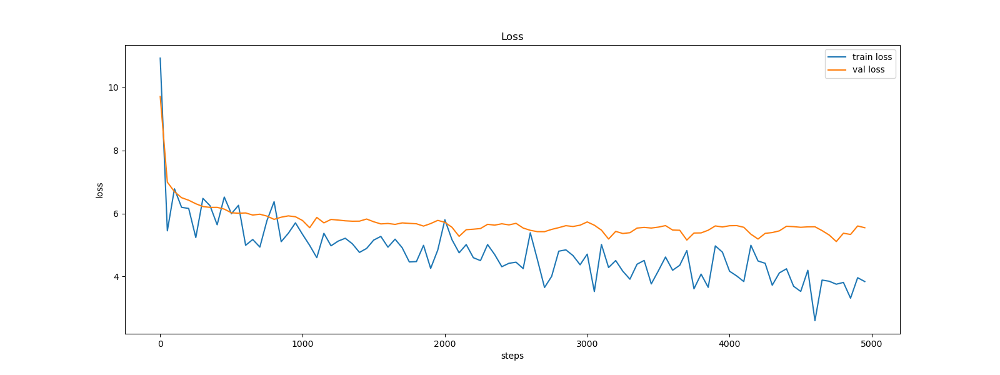

# GPT-2 from Scratch on M1 Mac
This repository contains the implementation of GPT-2 built from scratch and tested on an M1 Mac.

## Reference

This project is inspired by Andrej Karpathy's tutorial. You can watch the detailed explanation in his [YouTube video](https://www.youtube.com/watch?v=l8pRSuU81PU&t=483s&ab_channel=AndrejKarpathy).

## Getting Started

### Prerequisites

- Python 3.8 or higher
- PyTorch
- Other dependencies as listed in `requirements.txt`

### Installation

1. **Clone the repository**:
    ```bash
    git clone https://github.com/your-username/your-repo-name.git
    cd your-repo-name
    ```

2. **Install the dependencies**:
    ```bash
    pip install -r requirements.txt
    ```


### Dataset

The dataset used for training is the [Tiny Shakespeare](https://raw.githubusercontent.com/karpathy/char-rnn/master/data/tinyshakespeare/input.txt) dataset. The dataset is stored in the `input.txt` file.

### Training
To train the GPT-2 model from scratch using the Tiny Shakespeare dataset, run the following command:
    ```
    python main.py
    ```

### Logs
Training logs can be found in the log.txt file under the log folder. The following figure shows the training and validation loss changes with the number of steps:



Testing loss: XX


### Running in Docker

You can also run the project in a Docker container by following these steps:

1. **Pull the Docker image**:

    ```bash
    docker pull robd003/python3.10:latest
    ```

2. **Build the Docker image**:

    ```bash
    sudo docker build -t gpt-2 .
    ```

3. **Run a Docker container**:

    ```bash
    sudo docker run -it --name gpt-2 -v $(pwd)/log:/app/log gpt-2 /bin/bash
    ```

This command creates a Docker container named `gpt-2` using the built Docker image `gpt-2`, mounts your local `log` directory to the container's `/app/log` directory, and opens a bash shell in the container.
